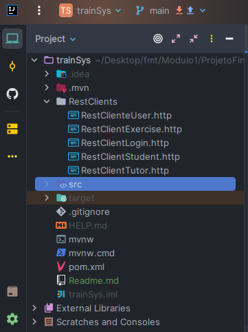
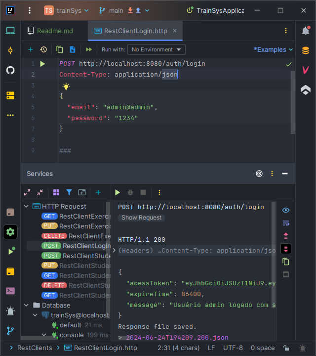
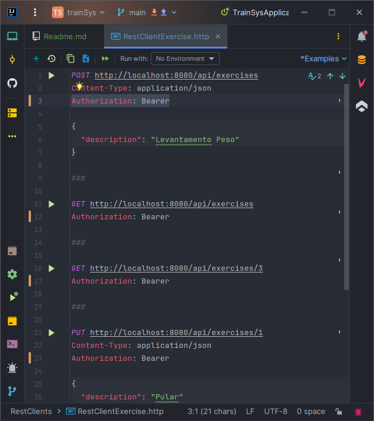

 <h1 align="center"> Projeto Avaliativo 02 </h1>

## ✏️ Descrição

O LAB365 Developer, empresa líder no segmento tecnológico de gestão educacional, está
com um novo desafio, intitulado TrainSys, uma API Rest completa dedicada aos instrutores
de academias para aprimorar a administração dos treinamentos de seus alunos. A empresa
está muito empolgada com o novo desafio, de levar a educação para outros setores, como os
de academias de ginástica. O seu perfil chamou a atenção dos gestores, para criar a primeira
versão da API, que deverá ser construída utilizando o framework Spring.

## 📌 Como usar 

1. Clone este repositório: [https://github.com/CorreaBrunoMiguel/trainSys.git](https://github.com/CorreaBrunoMiguel/trainSys.git)  
    
2. Rode a aplicação: TarinSysApplication.`CTRL+ALT+F5`  
    Ao iniciar a aplicação, será feita uma pré-injeção de dados no banco de dados para criação do user: Admin. Esse user terá acesso irrestrito aos endpoints da aplicação.

3. Abra a pasta RestClients e abre o arquivo RestClientLogin.htpp 

    

    Rode a requisição POST, pera gerar seu token de acesso. E receber a mensagem que usuário está logado.

    

    Copi o valor do token. Esse token será necessário para que o usuário esteja autenticado ao fazer requisições htpp nos endpoints da aplicação.  

4. Agora você pode acessar as rotas da aplicação e fazer o CRUD das entidades.

   Abra os respectivos arquivos RestClient{Entities}.http.  
   Cole o token da etapa anterior após o `Authorization: Bearer` (sem aspas).  
   Isso permitirá acesso as rotas.  

   
    